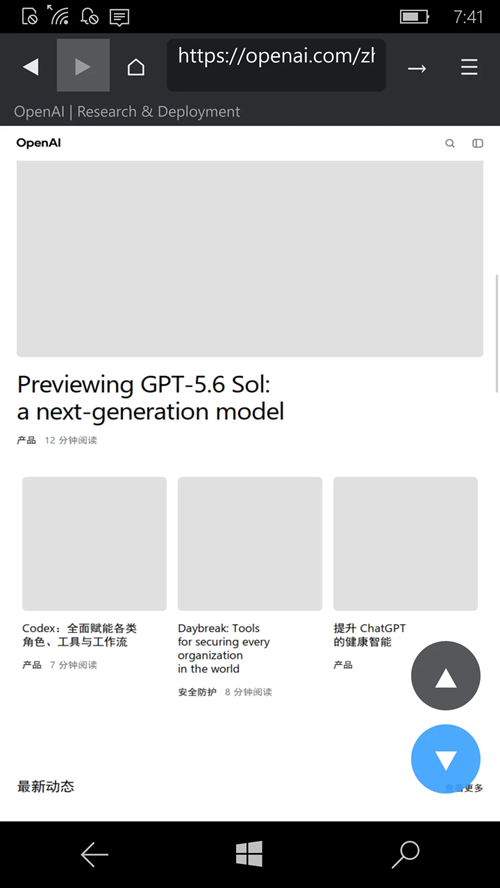

# Project_Apotheosis - dev branch 



##关于 

这是我的fork project-Apotheosis（project-Apotheosis v0.1.8.4）by Jimmy Xiao2009。

将代表**WebKit/WebCore*****windows10mobile*arm32*uwp*********************
带回一个已经被微软抛弃的Windows phone生态系统，可以使用JIT运行真实的网页。用于GPU合成的现代渲染引擎。

>将现代**WebKit/WebCore**渲染引擎移植到**Windows10mobile(ARM32,UWP)** —
>将真实的、JIT加速的、GPU合成的浏览器引擎带回废弃的Windows Phone平台。

##状态

机(Lumia,ARM32,Windows10mobile15254):

-W**WTF+JavaScriptCore**CLoop课程（第0阶段）
-***WebCore+Cairo软件渲染**--Bing/Censor/Apple/Micro等真实网站的正确渲染。
-***常驻交互会话**--真实鼠标事件转发（点击/表单/链接导航），滚动触发延迟加载，屏幕键盘输入
 保护简短的"codeGeneration"功能后的应用程序容器向下运行，由jscjit机器生成。
--角度（D3D11FL9_3）+WebCore**TextureMapper**，角度。..角度,
-***平滑滚动/捏合缩放（M3/M4）**--直线渲染，快速滚动+实时缩放变换+以新的比例重新网格
-将Ui更改为Safari/edge形状

##架构

```
┌─────────────────────────────────────────────┐
＜Harness(C++/CX UWP App)＞
 网页：所有单张/免责/下载
←*触摸手势→引擎滚动/点击/缩放←
│*GpuPanel(SwapChainPanel)←gpu现金
└───────────────┬─────────────────────────────┘
                │C ABI(WebCoreDriver.h)
┌───────────────▼─────────────────────────────┐
＜WebCoreDriver(port/)＞
＊*常驻页面会议/真实事件分发/链接提取＊
│*paintToRGBA：Cairo Software/TextureMapper GPU？
│*PortChromeClient/FrameLoaderClient等│
└───────────────┬─────────────────────────────┘
                │
┌───────────────▼─────────────────────────────┐
│WebKit/WebCore/JSC/WTF(为您服务)
 收费机。
└─────────────────────────────────────────────┘
```

##跟踪内容

该仓库只跟踪移植层和主机，**不包含**GB级上游源（矢量化后保存），可以从:

-'port`'--WebCore驱动程序、端口层客户端、每个存根和/或链接脚本
-'harness/'--uwp主页应用程序（C++/CX），XAML UI，appx跟踪
-'工具/'--wdp（设备门户）占主导地位？

#＃已完成的项目，并添加新的。

自上次文档以来的主要更改:

-✅Repo清理：~60调试/repro文件从端口中删除/
SrcSrc/setenv.ps1使用env vars创建所有路径
-全部E:\Apotheosis\paths.ps1/.bat/.cmake 文件→$env:APOTHEOSIS_ROOT或%APOTHEOSIS_ROOT%
 所有引用都固定在.ps1脚本中
- ✅ .为en-US,zh-Hans,ru-RU创建的resw文件
-双源字符串加载（。resw+回退形式）
 所有硬编码的中文祝酒词都被替换为GetStr()
xx64构建基础设施
-WebKit升级研究完成(WEBKIT-UPGRADE.md ）
-多语言UI，64，关键修正，架构
-建造Plan.md &Summary.md 文件，建立系统和依赖关系，以及发现

##Construct/Build（只要敲门）

Arm32uwp单克隆抗体(clang-cl+lld-link)。见(cairo/Icu/LIBCURL/freetype/harfbuzz/angle...）lib'，再次:

``` 
（PowerShell）
# 1. →WebCoreDriver-gpu。图书馆
pwsh-文件端口\链接-驱动程序-gpu.ps1
# 2. 主体appx
pwsh-文件端口\build-harness.ps1
# 3. Device portal,设备门户
pwsh-File tools\deploy-launch.ps1-Ver<压缩文件>
```

##表面/目标

UWP10.0.15063.

##参考资料/感谢/学分

-https://www.reddit.com/r/windowsphone/comments/1ugn2kn/porting_webkitgtk_2524_to_windows_10_mobile/将Webkitgtk2.52.4移植到Windows10mobile(2026年6月27日)
-https://github.com/Jimmyxiao2009/Project-Apotheosis "Project-Apotheosis"::*为永远不会让它死亡的人复兴Windows Phone web。* 📱
-https://github.com/Jimmyxiao2009 Jimmyxiao2009，中国热感应编码器 


## .

如斯。 没有支持。 仅限RnD。 DIY。

## ..

[M]E]2026年6月28日